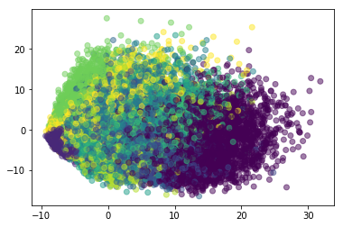

```python
import os
import math
import pandas as pd
import numpy as np
import re
from sklearn.model_selection import train_test_split, cross_val_score, GridSearchCV
from sklearn.metrics import roc_curve, auc, roc_auc_score, accuracy_score, classification_report
from sklearn.decomposition import PCA, SparsePCA
from sklearn.svm import SVC, LinearSVC
from sklearn.neural_network import MLPClassifier
from sklearn.linear_model import LogisticRegression
from sklearn.multiclass import OneVsRestClassifier, OneVsOneClassifier
from sklearn.neighbors.nearest_centroid import NearestCentroid
from sklearn.ensemble import AdaBoostClassifier, VotingClassifier, RandomForestClassifier
from sklearn.naive_bayes import GaussianNB
from sklearn.neighbors import KNeighborsClassifier, NearestNeighbors
from sklearn.multioutput import MultiOutputClassifier
from sklearn.preprocessing import MultiLabelBinarizer, Normalizer, StandardScaler, scale
from sklearn.externals import joblib
```


```python
np.random.seed(seed=2323)
```


```python
df = pd.read_csv("https://raw.githubusercontent.com/romeokienzler/developerWorks/master/train.csv")
```


```python
df.shape
```


    (42000, 785)


```python
%matplotlib inline

import matplotlib
import matplotlib.pyplot as plt
from mpl_toolkits.mplot3d import Axes3D
import matplotlib.pyplot as plt
```


```python
zeros = df.apply(lambda x: not all(x == 0), axis = 0)
df = df[zeros.index[zeros]]
X = df.iloc[:, 1:df.shape[1]].as_matrix()
X = scale(X)
```

    /Users/dominikpeter/anaconda/lib/python3.6/site-packages/sklearn/utils/validation.py:429: DataConversionWarning: Data with input dtype int64 was converted to float64 by the scale function.
      warnings.warn(msg, _DataConversionWarning)


```python
pca = PCA(n_components=2)
Xp = pca.fit_transform(X)
```


```python
plt.scatter(Xp[:,0], Xp[:,1], c = df['label'], alpha=0.5)
plt.show()
```





```python
df.head(5)
```


<div>
<table border="1" class="dataframe">
  <thead>
    <tr style="text-align: right;">
      <th></th>
      <th>label</th>
      <th>pixel12</th>
      <th>pixel13</th>
      <th>pixel14</th>
      <th>pixel15</th>
      <th>pixel32</th>
      <th>pixel33</th>
      <th>pixel34</th>
      <th>pixel35</th>
      <th>pixel36</th>
      <th>...</th>
      <th>pixel770</th>
      <th>pixel771</th>
      <th>pixel772</th>
      <th>pixel773</th>
      <th>pixel774</th>
      <th>pixel775</th>
      <th>pixel776</th>
      <th>pixel777</th>
      <th>pixel778</th>
      <th>pixel779</th>
    </tr>
  </thead>
  <tbody>
    <tr>
      <th>0</th>
      <td>1</td>
      <td>0</td>
      <td>0</td>
      <td>0</td>
      <td>0</td>
      <td>0</td>
      <td>0</td>
      <td>0</td>
      <td>0</td>
      <td>0</td>
      <td>...</td>
      <td>0</td>
      <td>0</td>
      <td>0</td>
      <td>0</td>
      <td>0</td>
      <td>0</td>
      <td>0</td>
      <td>0</td>
      <td>0</td>
      <td>0</td>
    </tr>
    <tr>
      <th>1</th>
      <td>0</td>
      <td>0</td>
      <td>0</td>
      <td>0</td>
      <td>0</td>
      <td>0</td>
      <td>0</td>
      <td>0</td>
      <td>0</td>
      <td>0</td>
      <td>...</td>
      <td>0</td>
      <td>0</td>
      <td>0</td>
      <td>0</td>
      <td>0</td>
      <td>0</td>
      <td>0</td>
      <td>0</td>
      <td>0</td>
      <td>0</td>
    </tr>
    <tr>
      <th>2</th>
      <td>1</td>
      <td>0</td>
      <td>0</td>
      <td>0</td>
      <td>0</td>
      <td>0</td>
      <td>0</td>
      <td>0</td>
      <td>0</td>
      <td>0</td>
      <td>...</td>
      <td>0</td>
      <td>0</td>
      <td>0</td>
      <td>0</td>
      <td>0</td>
      <td>0</td>
      <td>0</td>
      <td>0</td>
      <td>0</td>
      <td>0</td>
    </tr>
    <tr>
      <th>3</th>
      <td>4</td>
      <td>0</td>
      <td>0</td>
      <td>0</td>
      <td>0</td>
      <td>0</td>
      <td>0</td>
      <td>0</td>
      <td>0</td>
      <td>0</td>
      <td>...</td>
      <td>0</td>
      <td>0</td>
      <td>0</td>
      <td>0</td>
      <td>0</td>
      <td>0</td>
      <td>0</td>
      <td>0</td>
      <td>0</td>
      <td>0</td>
    </tr>
    <tr>
      <th>4</th>
      <td>0</td>
      <td>0</td>
      <td>0</td>
      <td>0</td>
      <td>0</td>
      <td>0</td>
      <td>0</td>
      <td>0</td>
      <td>0</td>
      <td>0</td>
      <td>...</td>
      <td>0</td>
      <td>0</td>
      <td>0</td>
      <td>0</td>
      <td>0</td>
      <td>0</td>
      <td>0</td>
      <td>0</td>
      <td>0</td>
      <td>0</td>
    </tr>
  </tbody>
</table>
<p>5 rows × 709 columns</p>
</div>


```python
X = df.iloc[:, 1:df.shape[1]].as_matrix()
X = scale(X)
y = df.iloc[:, 0].as_matrix()
```

    /Users/dominikpeter/anaconda/lib/python3.6/site-packages/sklearn/utils/validation.py:429: DataConversionWarning: Data with input dtype int64 was converted to float64 by the scale function.
      warnings.warn(msg, _DataConversionWarning)


```python
pca = PCA(n_components=100)
X = pca.fit_transform(X)
```


```python
X.shape
```


    (42000, 100)


```python
X_train, X_test, y_train, y_test = train_test_split(X, y, test_size=0.20, random_state=42)
```


```python
X_train.shape
```


    (33600, 100)


```python
X_test.shape
```


    (8400, 100)


```python
rf = RandomForestClassifier(n_estimators=940, n_jobs=2)
rf.fit(X_train, y_train)
```


    RandomForestClassifier(bootstrap=True, class_weight=None, criterion='gini',
                max_depth=None, max_features='auto', max_leaf_nodes=None,
                min_impurity_split=1e-07, min_samples_leaf=1,
                min_samples_split=2, min_weight_fraction_leaf=0.0,
                n_estimators=940, n_jobs=2, oob_score=False, random_state=None,
                verbose=0, warm_start=False)


```python
y_test_pred = rf.predict(X_test)
y_test_true = y_test

#print(roc_auc_score(y_test_true, y_test_pred, average='macro',sample_weight=None))
print(classification_report(y_test_true, y_test_pred))
```

                 precision    recall  f1-score   support
    
              0       0.97      0.97      0.97       816
              1       0.99      0.98      0.99       909
              2       0.94      0.95      0.94       846
              3       0.92      0.93      0.92       937
              4       0.95      0.95      0.95       839
              5       0.94      0.92      0.93       702
              6       0.95      0.98      0.96       785
              7       0.95      0.94      0.94       893
              8       0.94      0.93      0.93       835
              9       0.92      0.91      0.92       838
    
    avg / total       0.95      0.95      0.95      8400
    


```python
nn = MLPClassifier(solver='lbfgs',
        hidden_layer_sizes=(1000, 500, 200, ), random_state=1, alpha = 1.0000000000000001e-05)
```


```python
nn.fit(X_train, y_train)
```


    MLPClassifier(activation='relu', alpha=1e-05, batch_size='auto', beta_1=0.9,
           beta_2=0.999, early_stopping=False, epsilon=1e-08,
           hidden_layer_sizes=(1000, 500, 200), learning_rate='constant',
           learning_rate_init=0.001, max_iter=200, momentum=0.9,
           nesterovs_momentum=True, power_t=0.5, random_state=1, shuffle=True,
           solver='lbfgs', tol=0.0001, validation_fraction=0.1, verbose=False,
           warm_start=False)


```python
y_test_pred = nn.predict(X_test)
y_test_true = y_test

#print(roc_auc_score(y_test_true, y_test_pred, average='macro',sample_weight=None))
print(accuracy_score(y_test_true, y_test_pred, normalize=True, sample_weight=None))
```

    0.975595238095


```python
print(classification_report(y_test_true, y_test_pred))
```

                 precision    recall  f1-score   support
    
              0       0.99      0.98      0.98       816
              1       0.99      0.99      0.99       909
              2       0.98      0.97      0.98       846
              3       0.97      0.96      0.97       937
              4       0.98      0.98      0.98       839
              5       0.95      0.96      0.96       702
              6       0.97      0.99      0.98       785
              7       0.98      0.98      0.98       893
              8       0.97      0.97      0.97       835
              9       0.97      0.97      0.97       838
    
    avg / total       0.98      0.98      0.98      8400
    


```python
parameters = {'weights':[[1,1], [1,2], [2,1]]}
vc = VotingClassifier(estimators=[('rf', rf),('nn', nn)], voting='soft', n_jobs=2)
fclf = GridSearchCV(vc, parameters, verbose=True)
fclf.fit(X_train, y_train)
```

    Fitting 3 folds for each of 3 candidates, totalling 9 fits


    [Parallel(n_jobs=1)]: Done   9 out of   9 | elapsed: 34.2min finished


    GridSearchCV(cv=None, error_score='raise',
           estimator=VotingClassifier(estimators=[('rf', RandomForestClassifier(bootstrap=True, class_weight=None, criterion='gini',
                max_depth=None, max_features='auto', max_leaf_nodes=None,
                min_impurity_split=1e-07, min_samples_leaf=1,
                min_samples_split=2, min_weight_fraction_leaf=0.0,
                n_...      solver='lbfgs', tol=0.0001, validation_fraction=0.1, verbose=False,
           warm_start=False))],
             n_jobs=2, voting='soft', weights=None),
           fit_params={}, iid=True, n_jobs=1,
           param_grid={'weights': [[1, 1], [1, 2], [2, 1]]},
           pre_dispatch='2*n_jobs', refit=True, return_train_score=True,
           scoring=None, verbose=True)


```python
fclf.best_estimator_
```


    VotingClassifier(estimators=[('rf', RandomForestClassifier(bootstrap=True, class_weight=None, criterion='gini',
                max_depth=None, max_features='auto', max_leaf_nodes=None,
                min_impurity_split=1e-07, min_samples_leaf=1,
                min_samples_split=2, min_weight_fraction_leaf=0.0,
                n_...      solver='lbfgs', tol=0.0001, validation_fraction=0.1, verbose=False,
           warm_start=False))],
             n_jobs=2, voting='soft', weights=[2, 1])


```python
y_test_pred = fclf.predict(X_test)
y_test_true = y_test

#print(roc_auc_score(y_test_true, y_test_pred, average='macro',sample_weight=None))
print(accuracy_score(y_test_true, y_test_pred, normalize=True, sample_weight=None))
```

    0.975357142857


```python
print(classification_report(y_test_true, y_test_pred))
```

                 precision    recall  f1-score   support
    
              0       0.99      0.98      0.98       816
              1       0.99      0.99      0.99       909
              2       0.98      0.97      0.98       846
              3       0.97      0.96      0.97       937
              4       0.98      0.98      0.98       839
              5       0.95      0.96      0.96       702
              6       0.97      0.99      0.98       785
              7       0.98      0.98      0.98       893
              8       0.97      0.97      0.97       835
              9       0.97      0.97      0.97       838
    
    avg / total       0.98      0.98      0.98      8400
    

