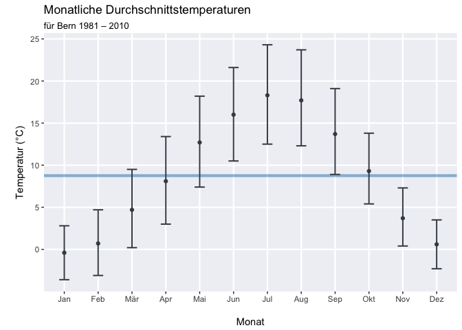

webscraping
================
Dominik Peter
18 12 2016

Take-Home: Webscraping
----------------------

    FALSE Loading required package: xml2

``` r
url <- 'https://de.wikipedia.org/wiki/Bern'
xpath <- '//*[@id="mw-content-text"]/table[4]'

html_table <- url %>%
  read_html() %>%
  html_node(xpath = xpath) %>%
  html_table(fill = TRUE, header = FALSE) %>%
  as.data.table(.)
```

``` r
# some indexing to get relevant data (with false because of data.table formatting)
n <- 12
df <- html_table[2:n, 1:(n+1), with = FALSE] # with=FALSE ist ab Version 1.10.0 nicht mehr nötig

# make clean header
header <- df[1, -1, with = FALSE] %>% as.character()
setnames(df, names(df), c("typ", header))
df <- df[-1, ]

# convert value to numeric and eliminate NA columns
to_numeric <- function(x) {
  x <- str_replace_all(x, ",", "\\.")
  as.numeric(x)
}

months <- colnames(df)[-1]
# apply function
df[, months] <- lapply(df[, months, with = FALSE], to_numeric)
# remove NA's
df <- df %>% na.omit(.)

knitr::kable(df)
```

| typ                  |   Jan|   Feb|   Mär|   Apr|    Mai|    Jun|    Jul|    Aug|   Sep|   Okt|   Nov|   Dez|
|:---------------------|-----:|-----:|-----:|-----:|------:|------:|------:|------:|-----:|-----:|-----:|-----:|
| Max. Temperatur (°C) |   2.8|   4.7|   9.5|  13.4|   18.2|   21.6|   24.3|   23.7|  19.1|  13.8|   7.3|   3.5|
| Min. Temperatur (°C) |  -3.6|  -3.1|   0.2|   3.0|    7.4|   10.5|   12.5|   12.3|   8.9|   5.4|   0.4|  -2.3|
| Temperatur (°C)      |  -0.4|   0.7|   4.7|   8.1|   12.7|   16.0|   18.3|   17.7|  13.7|   9.3|   3.7|   0.6|
| Niederschlag (mm)    |  60.0|  55.0|  73.0|  82.0|  119.0|  111.0|  106.0|  116.0|  99.0|  88.0|  76.0|  74.0|
| Sonnenstunden (h/d)  |   2.1|   3.1|   4.4|   5.3|    5.9|    6.8|    7.6|    7.0|   5.5|   3.6|   2.3|   1.6|
| Regentage (d)        |   9.6|   9.0|  10.6|  10.4|   12.6|   11.1|   10.8|   10.7|   8.9|  10.4|  10.2|   9.9|

``` r
tidy_df <- df[1:3] %>%
  melt(id.vars = "typ", variable.name = "Monat") %>% 
  dcast(Monat ~ typ)

col_names <- colnames(tidy_df)
setnames(tidy_df, col_names, c(col_names[1], c("Max", "Min", "Mittelwert")))

knitr::kable(tidy_df)
```

| Monat |   Max|   Min|  Mittelwert|
|:------|-----:|-----:|-----------:|
| Jan   |   2.8|  -3.6|        -0.4|
| Feb   |   4.7|  -3.1|         0.7|
| Mär   |   9.5|   0.2|         4.7|
| Apr   |  13.4|   3.0|         8.1|
| Mai   |  18.2|   7.4|        12.7|
| Jun   |  21.6|  10.5|        16.0|
| Jul   |  24.3|  12.5|        18.3|
| Aug   |  23.7|  12.3|        17.7|
| Sep   |  19.1|   8.9|        13.7|
| Okt   |  13.8|   5.4|         9.3|
| Nov   |   7.3|   0.4|         3.7|
| Dez   |   3.5|  -2.3|         0.6|

Plotting: Nicht Teil der Aufgabenstellung

``` r
mean_temp <- mean(tidy_df$Mittelwert)

tidy_df  %>% 
  ggplot(aes(x = Monat, y = Mittelwert)) +
  geom_point(size = 1.5, color = "#444B54") +
  geom_hline(yintercept = mean_temp, color = "#2980B9", size = 1.5, alpha = 0.25) +
  geom_errorbar(aes(ymin = Min, ymax = Max), width = 0.3, color = "#444B54", size = 0.7) +
  ylab("\nTemperatur (°C)") +
  xlab("\nMonat") +
  ggtitle("Monatliche Durchschnittstemperaturen", subtitle = "für Bern 1981 – 2010") +
  theme(panel.background = element_rect(fill = "#F0F1F5"),
        panel.grid.major = element_line(color = "white", size = 0.8),
        panel.grid.minor = element_blank())
```


